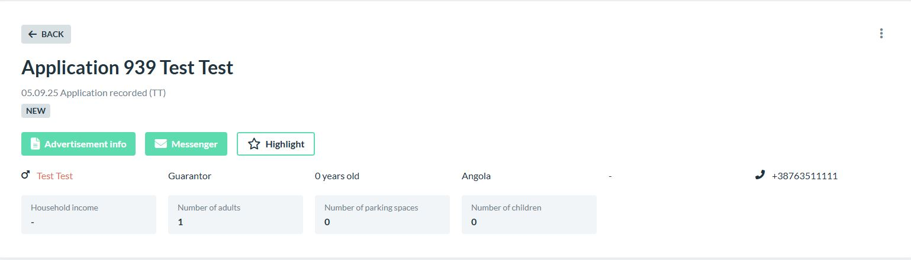
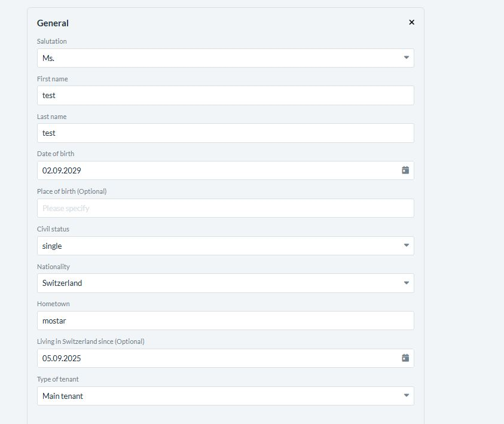
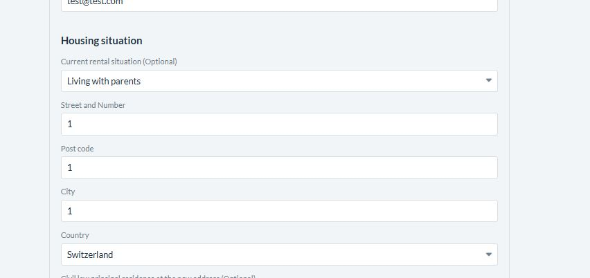
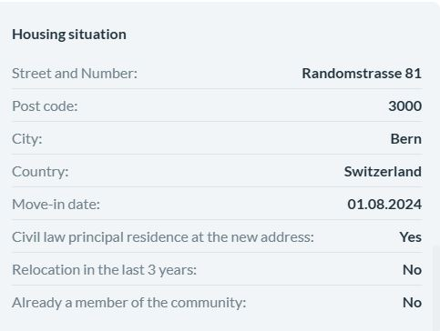

# Apartment QA Testing

A comprehensive Python-based QA testing suite for apartment web applications using Playwright automation framework.

## Overview

This project provides automated testing solutions for apartment management web applications, offering both focused admin verification/validation tests and comprehensive full-application testing capabilities.


## Prerequisites

Ensure you have the following installed on your system:

- **Python 3.13+** (tested with Python 3.13.7)
- **pip** (tested with pip 25.2)
- **Virtual Environment** capabilities

## Installation

1. **Clone the repository**
   ```bash
   git clone https://github.com/AntonioPavkovic/apartment-qa-testing.git
   cd apartment-qa-testing
   ```

2. **Set up virtual environment**
   ```bash
   python -m venv venv
   ```

3. **Activate virtual environment**
   ```bash
   # Windows
   venv\Scripts\activate
   
   # macOS/Linux
   source venv/bin/activate
   ```

4. **Install dependencies**
   ```bash
   pip install -r requirements.txt
   ```

5. **Install Playwright browsers** (if not already installed)
   ```bash
   playwright install
   ```

## Usage

### Prerequisites for Running Tests

Before executing any tests, ensure you:

1. **Navigate to project directory**
   ```bash
   cd apartment-qa-testing
   ```

2. **Activate virtual environment**
   ```bash
   venv\Scripts\activate
   ```

### Running Tests

#### Admin Verification & Validation Tests

For focused testing of administrative features with verification and validation:

```bash
python test_admin_only.py
```


#### Comprehensive Application Tests

For complete end-to-end testing of the entire apartment application:

```bash
python test_melon_apartment.py
```


## Author

**Antonio Pavkovic**
- GitHub: [@AntonioPavkovic](https://github.com/AntonioPavkovic)

## Acknowledgments

- Built with [Playwright](https://playwright.dev/) for reliable browser automation


## BUGS FOUND WHILE MANUALLY TESTING

### Bug #1: Infant Counted as Adult Applicant
**Severity:** Medium
**Category:** Data Validation / Business Logic

**Steps to Reproduce:**
1. Navigate to apartment application form
2. Fill out personal information for applicant
3. Set birth date to current date minus 2-3 days (making applicant ~0 years old)
4. Complete and submit application
5. Check admin panel application details

**Expected Result:** 
- System should reject birth date that makes applicant under 18
- OR system should not count infants in "Number of adults" field
- Should show validation error for invalid age

**Actual Result:** 
- Application accepts infant birth date
- Counts infant as "1 adult" 
- Shows "0 years old" but still classifies as adult
- No validation error displayed

**Impact:** 
- Could lead to invalid rental applications
- Confusion for property managers
- Potential legal compliance issues

**Suggested Fix:**
- Add age validation (minimum 18 years for primary applicant)
- Separate counting logic for adults vs children vs infants
- Clear error message for invalid birth dates




### Bug #2: Multiple adults in a single household

**Severity:** Medium
**Category:** Data Validation / Business Logic

**Steps to Reproduce:**
1. Navigate to apartment application form
2. Fill out personal information for applicant
3. Select a single person household
4. Add multiple adults
5. Check admin panel application details

**Expected Result:** 
- System should reject the second adult


**Actual Result:** 
- Application accepts both adults




### Bug #3: Birth date in the future (2029) but living in Switzerland in the current year

**Severity:** Medium
**Category:** Data Validation / Business Logic

**Steps to Reproduce:**
1. Navigate to apartment application form
2. Fill out personal information for applicant
3. Select a single person household
4. Add the birth date in the future and living in switzerland since to the current year
5. Check admin panel application details

**Expected Result:** 
- System should reject the birth dates in the future


### Bug #4: Application accepts numbers for street name and city name

**Severity:** Medium
**Category:** Data Validation / Business Logic

**Steps to Reproduce:**
1. Navigate to apartment application form
2. Fill out personal information for applicant
3. Select a single person household
4. Fill out the city name and street name as numbers
5. Check admin panel application details

**Expected Result:** 
- System should reject number for city and street name


### Bug #4: Move in date set in the past (2024) while looking for the apartment in 2025 
### Potential issue with street name and Postal number

**Severity:** Medium
**Category:** Data Validation / Business Logic

**Steps to Reproduce:**
1. Navigate to apartment application form
2. Fill out personal information for applicant
3. Select a single person household
4. Add move in date in the past, some random number for the Postal Code and Street name
5. Check admin panel application details

**Expected Result:** 
- System should reject the adult


**Actual Result:** 
- Application accepts the adult

